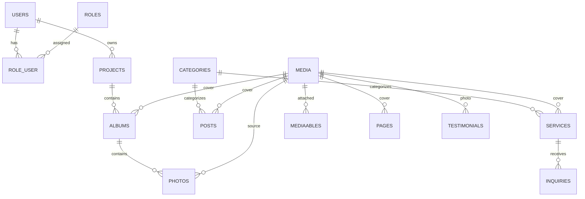

# Database Structure

## Общая информация

Проект: Фотосказка

Стек:

* Laravel 13
* MySQL 8
* Filament 4

Назначение системы:

* сайт фотографа;
* блог;
* портфолио;
* заявки клиентов;
* клиентские галереи;
* выпускные альбомы.

---

# Основные сущности

## Пользователи

Все пользователи системы хранятся в одной таблице.

Роли определяются через таблицы:

* roles
* role_user

Поддерживаемые роли:

* admin
* photographer
* client
* parent
* class_manager

---

# ER Diagram



---

# Tables

## users

```sql
id BIGINT PRIMARY KEY

name VARCHAR(255)

email VARCHAR(255) UNIQUE

phone VARCHAR(50) NULL

email_verified_at TIMESTAMP NULL

password VARCHAR(255)

status ENUM(
    'active',
    'inactive'
) DEFAULT 'active'

remember_token VARCHAR(100)

created_at TIMESTAMP
updated_at TIMESTAMP
```

Indexes:

```sql
UNIQUE(email)
INDEX(phone)
INDEX(status)
```

---

## roles

```sql
id BIGINT PRIMARY KEY

name VARCHAR(255)

slug VARCHAR(100)

created_at TIMESTAMP
updated_at TIMESTAMP
```

Indexes:

```sql
UNIQUE(slug)
```

Начальные данные:

| slug          | name                    |
| ------------- | ----------------------- |
| admin         | Администратор           |
| photographer  | Фотограф                |
| client        | Клиент                  |
| parent        | Родитель                |
| class_manager | Ответственный по классу |

---

## role_user

```sql
user_id BIGINT

role_id BIGINT

PRIMARY KEY(user_id, role_id)
```

Indexes:

```sql
INDEX(role_id)
```

---

## categories

Универсальные категории.

```sql
id BIGINT PRIMARY KEY

name VARCHAR(255)

slug VARCHAR(255)

type ENUM(
    'service',
    'post'
)

sort_order INT DEFAULT 0

created_at TIMESTAMP
updated_at TIMESTAMP
```

Indexes:

```sql
UNIQUE(slug, type)
INDEX(type)
INDEX(sort_order)
```

---

## media

Централизованное файловое хранилище.

```sql
id BIGINT PRIMARY KEY

title VARCHAR(255) NULL

alt_text VARCHAR(255) NULL

disk VARCHAR(50)

file_path VARCHAR(1000)

thumbnail_path VARCHAR(1000) NULL

mime_type VARCHAR(255) NULL

width INT NULL

height INT NULL

file_size BIGINT NULL

collection VARCHAR(100) NULL

created_at TIMESTAMP
updated_at TIMESTAMP
```

Indexes:

```sql
INDEX(disk)
INDEX(created_at)
```

---
## mediaables

```sql
id BIGINT PRIMARY KEY 
media_id BIGINT 
mediaable_type VARCHAR(255) 
mediaable_id BIGINT 
sort_order INT DEFAULT 0
created_at TIMESTAMP 
updated_at TIMESTAMP
```
Indexes:

```sql
INDEX(media_id) 
INDEX(mediaable_type, mediaable_id) 
INDEX(sort_order)
```
---
## Pages

```sql
id BIGINT PRIMARY KEY 
cover_media_id BIGINT NULL 
title VARCHAR(255) 
slug VARCHAR(255) 
excerpt TEXT NULL 
content LONGTEXT NULL 
seo_title VARCHAR(255) NULL 
seo_description TEXT NULL 
is_published BOOLEAN DEFAULT TRUE 
sort_order INT DEFAULT 0 
created_at TIMESTAMP 
updated_at TIMESTAMP

```
Indexes:

```sql
UNIQUE(slug)

INDEX(is_published)

INDEX(sort_order)
```

---

## services

```sql
id BIGINT PRIMARY KEY

category_id BIGINT NULL

cover_media_id BIGINT NULL

title VARCHAR(255)

slug VARCHAR(255)

short_description TEXT NULL

description LONGTEXT NULL

price_from DECIMAL(10,2) NULL

is_published BOOLEAN DEFAULT TRUE

sort_order INT DEFAULT 0

created_at TIMESTAMP
updated_at TIMESTAMP

seo_title VARCHAR(255) NULL 
seo_description TEXT NULL
```

Indexes:

```sql
UNIQUE(slug)
INDEX(category_id)
INDEX(is_published)
INDEX(sort_order)
```

---

## projects

Универсальная сущность съёмки.

Может представлять:

* свадьбу;
* выпускной класс;
* детский сад;
* индивидуальную фотосессию;
* семейную съёмку;
* мероприятие.

```sql
id BIGINT PRIMARY KEY

client_id BIGINT NULL

manager_id BIGINT NULL

title VARCHAR(255)

slug VARCHAR(255) NULL

type ENUM(
    'individual',
    'family',
    'event',
    'wedding',
    'school',
    'kindergarten'
)

description TEXT NULL

shooting_date DATE NULL

status ENUM(
    'draft',
    'active',
    'completed',
    'archived'
)

created_at TIMESTAMP
updated_at TIMESTAMP
```

Indexes:

```sql
INDEX(client_id)
INDEX(manager_id)
INDEX(type)
INDEX(status)
INDEX(shooting_date)
```

---

## albums

Фотоальбом.

```sql
id BIGINT PRIMARY KEY

project_id BIGINT NULL

cover_media_id BIGINT NULL

title VARCHAR(255)

slug VARCHAR(255)

description TEXT NULL

type VARCHAR(20) DEFAULT 'portfolio'

is_featured BOOLEAN DEFAULT FALSE

is_published BOOLEAN DEFAULT TRUE

sort_order INT DEFAULT 0

created_at TIMESTAMP
updated_at TIMESTAMP

seo_title VARCHAR(255) NULL 
seo_description TEXT NULL
```

Возможные значения type:

| type       | Назначение                 |
| ---------- | -------------------------- |
| portfolio  | Галереи портфолио          |
| project    | Альбомы съёмок             |
| homepage   | Слайдеры главной страницы  |
| service    | Галереи услуг              |
| client     | Клиентские галереи         |

Indexes:

```sql
UNIQUE(slug)

INDEX(project_id)

INDEX(is_featured)

INDEX(is_published)

INDEX(type)
```

---

## photos

Фотографии альбома.

```sql
id BIGINT PRIMARY KEY

album_id BIGINT

media_id BIGINT

caption VARCHAR(255) NULL

sort_order INT DEFAULT 0

created_at TIMESTAMP
updated_at TIMESTAMP
```

Indexes:

```sql
INDEX(album_id)

INDEX(media_id)

INDEX(sort_order)
```

---

## posts

Блог.

```sql
id BIGINT PRIMARY KEY

category_id BIGINT NULL

cover_media_id BIGINT NULL

title VARCHAR(255)

slug VARCHAR(255)

excerpt TEXT NULL

content LONGTEXT

published_at DATETIME NULL

is_published BOOLEAN DEFAULT TRUE

created_at TIMESTAMP
updated_at TIMESTAMP

seo_title VARCHAR(255) NULL 
seo_description TEXT NULL
```

Indexes:

```sql
UNIQUE(slug)

INDEX(category_id)

INDEX(is_published)

INDEX(published_at)
```

---

## testimonials

Отзывы клиентов.

```sql
id BIGINT PRIMARY KEY

media_id BIGINT NULL

client_name VARCHAR(255)

content TEXT

sort_order INT DEFAULT 0

is_published BOOLEAN DEFAULT TRUE

created_at TIMESTAMP
updated_at TIMESTAMP
```

Indexes:

```sql
INDEX(is_published)

INDEX(sort_order)
```

---

## inquiries

Заявки.

```sql
id BIGINT PRIMARY KEY

user_id BIGINT NULL

service_id BIGINT NULL

name VARCHAR(255)

phone VARCHAR(50)

email VARCHAR(255) NULL

message TEXT NULL

shooting_date DATE NULL

status ENUM(
    'new',
    'in_progress',
    'completed',
    'cancelled'
)

created_at TIMESTAMP
updated_at TIMESTAMP
```

Indexes:

```sql
INDEX(user_id)

INDEX(service_id)

INDEX(status)

INDEX(phone)

INDEX(created_at)
```

---

# Storage Strategy

Текущий этап:

```text
Laravel Filesystem
↓
Local/Public Storage
```

Будущий этап:

```text
Laravel Filesystem
↓
Yandex Disk API
↓
Local Thumbnail Cache
```

Все обращения к файлам должны происходить через Laravel Storage API.

---

# Planned Future Extensions

Будущие сущности:

* project_users
* graduation_classes
* graduation_students
* orders
* payments
* chat_messages
* notifications
* yandex_disk_sync

Текущая архитектура должна позволять их добавление без изменения существующих таблиц.
