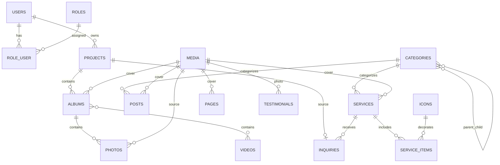

# Database Structure

## Общая информация

Проект: Фотосказка

Стек:

* Laravel 13
* MySQL 8
* Filament 4

Назначение системы:

* сайт фотографа;
* блог;
* портфолио;
* заявки клиентов;
* клиентские галереи;
* выпускные альбомы.

---

# Основные сущности

## Пользователи

Все пользователи системы хранятся в одной таблице.

Роли определяются через таблицы:

* roles
* role_user

Поддерживаемые роли:

* admin
* photographer
* client
* parent
* class_manager

---

# ER Diagram



---

# Tables

## users

```sql
id BIGINT PRIMARY KEY

name VARCHAR(255)

email VARCHAR(255) UNIQUE

phone VARCHAR(50) NULL

email_verified_at TIMESTAMP NULL

password VARCHAR(255)

status ENUM(
    'active',
    'inactive'
) DEFAULT 'active'

remember_token VARCHAR(100)

created_at TIMESTAMP
updated_at TIMESTAMP
```

Foreign keys: (none)

Indexes:

```sql
UNIQUE(email)
INDEX(phone)
INDEX(status)
```

---

## roles

```sql
id BIGINT PRIMARY KEY

name VARCHAR(255)

slug VARCHAR(100) UNIQUE

is_system BOOLEAN DEFAULT TRUE

created_at TIMESTAMP
updated_at TIMESTAMP
```

Indexes:

```sql
UNIQUE(slug)
INDEX(is_system)
```

Начальные данные:

| slug          | name                    |
| ------------- | ----------------------- |
| admin         | Администратор           |
| photographer  | Фотограф                |
| client        | Клиент                  |
| parent        | Родитель                |
| class_manager | Ответственный по классу |

---

## role_user

```sql
user_id BIGINT

role_id BIGINT

PRIMARY KEY(user_id, role_id)
```

Foreign keys:

```sql
user_id -> users.id ON DELETE CASCADE
role_id -> roles.id ON DELETE CASCADE
```

---

## service_service_item

Pivot для many-to-many связи услуг и пунктов услуг.

```sql
service_id BIGINT UNSIGNED
service_item_id BIGINT UNSIGNED
is_included BOOLEAN DEFAULT TRUE
sort_order INT DEFAULT 0

PRIMARY KEY(service_id, service_item_id)
```

Foreign keys:

```sql
service_id -> services.id ON DELETE CASCADE
service_item_id -> service_items.id ON DELETE CASCADE
```

Indexes:

```sql
INDEX(service_id)
INDEX(sort_order)
```

---

## album_service

Pivot для many-to-many связи услуг и альбомов-примеров.

```sql
album_id BIGINT UNSIGNED
service_id BIGINT UNSIGNED

PRIMARY KEY(album_id, service_id)
```

Foreign keys:

```sql
album_id -> albums.id ON DELETE CASCADE
service_id -> services.id ON DELETE CASCADE
```

Indexes:

```sql
INDEX(service_id)
```

---

## album_video

Pivot для many-to-many связи альбомов и видео (аналогично фото: видео можно добавлять в альбом).
```sql
album_id BIGINT UNSIGNED
video_id BIGINT UNSIGNED
caption VARCHAR(255) NULL
sort_order INT DEFAULT 0

PRIMARY KEY(album_id, video_id)
```

Foreign keys:

```sql
album_id -> albums.id ON DELETE CASCADE
video_id -> videos.id ON DELETE CASCADE
```

Indexes:

```sql
INDEX(sort_order)
```

Сортировка внутри альбома — `album_video.sort_order`. Видео остаются самостоятельной сущностью
(раздел `/video`, главная страница) и могут одновременно принадлежать нескольким альбомам.

---

## service_video

Pivot для many-to-many связи услуг и видео (видео, прикреплённые напрямую к услуге, без альбома).

```sql
service_id BIGINT UNSIGNED
video_id BIGINT UNSIGNED

PRIMARY KEY(service_id, video_id)
```

Foreign keys:

```sql
service_id -> services.id ON DELETE CASCADE
video_id -> videos.id ON DELETE CASCADE
```

---

## post_video

Pivot для many-to-many связи статей блога и видео.

```sql
post_id BIGINT UNSIGNED
video_id BIGINT UNSIGNED

PRIMARY KEY(post_id, video_id)
```

Foreign keys:

```sql
post_id -> posts.id ON DELETE CASCADE
video_id -> videos.id ON DELETE CASCADE
```

---

## category_video

Pivot для many-to-many связи категорий и видео (видео, прикреплённые к категории
и показываемые на её публичной странице `/services/...`).

```sql
category_id BIGINT UNSIGNED
video_id BIGINT UNSIGNED

PRIMARY KEY(category_id, video_id)
```

Foreign keys:

```sql
category_id -> categories.id ON DELETE CASCADE
video_id -> videos.id ON DELETE CASCADE
```

Порядок вывода — `videos.sort_order` (как у `service_video`).

---

## category_service_item

Pivot для many-to-many связи категорий и пунктов «Что входит»
(общий список пунктов категории на её публичной странице `/services/...`).

```sql
category_id BIGINT UNSIGNED
service_item_id BIGINT UNSIGNED
is_included BOOLEAN DEFAULT TRUE
sort_order INT DEFAULT 0

PRIMARY KEY(category_id, service_item_id)
```

Foreign keys:

```sql
category_id -> categories.id ON DELETE CASCADE
service_item_id -> service_items.id ON DELETE CASCADE
```

Indexes:

```sql
INDEX(sort_order)
```

Аналогично `service_service_item`: `is_included` — «включено в цену»,
`sort_order` — порядок вывода пунктов.

Foreign keys:

```sql
post_id -> posts.id ON DELETE CASCADE
video_id -> videos.id ON DELETE CASCADE
```

---

### Система ролей

Пользователи могут иметь неограниченное количество ролей (many-to-many через `role_user`).

Системные роли (`is_system = true`) защищены от удаления и изменения `slug`.
Пользовательские роли (`is_system = false`) доступны для полного редактирования.

Поле `is_system` добавлено миграцией `add_is_system_to_roles_table`.

### Доступ в административную панель

Доступ к `/admin` (Filament) разрешён только пользователям:
- со статусом `active`;
- имеющим роль `admin`.

Метод `User::canAccessPanel()` проверяет оба условия.
Остальные пользователи перенаправляются на страницу входа.

---

## categories

Универсальные категории.

Для `type = service` поддерживается иерархия (самоподчинение через `parent_id`)
с неограниченной глубиной вложенности. Для `type = post` поведение плоское —
категория блога привязана напрямую к статьям.

```sql
id BIGINT PRIMARY KEY

parent_id BIGINT NULL
cover_media_id BIGINT NULL
name VARCHAR(255)
slug VARCHAR(255)
type ENUM(
    'service',
    'post'
)
description TEXT NULL
price_from DECIMAL(10,2) NULL
price_note TEXT NULL
seo_title VARCHAR(255) NULL
seo_description TEXT NULL
is_published BOOLEAN DEFAULT TRUE
sort_order INT DEFAULT 0

created_at TIMESTAMP
updated_at TIMESTAMP
```

Связь:

```sql
parent_id -> categories.id ON DELETE SET NULL
cover_media_id -> media.id ON DELETE SET NULL
```

Иерархия: `categories.parent_id` → `categories.id` (self-referencing).

Получатели:

| Метод       | Связь / назначение                                           |
|-------------|--------------------------------------------------------------|
| `parent()`  | Непосредственный родитель (BelongsTo)                        |
| `children()`| Дочерние категории (HasMany)                                 |
| `cover()`   | Обложка категории (BelongsTo → media)                        |
| `services()`| Услуги, непосредственно принадлежащие категории (HasMany)    |
| `posts()`   | Статьи блога, принадлежащие категории (HasMany)              |
| `ancestors()` | Цепочка предков от корня до родителя (корневая → `[]`)     |
| `descendants()` | Все потомки в глубину любых уровней                       |
| `path(true)` | Полный путь от корня до самой категории                     |

Защита от циклов реализована на уровне модели (`saving` + `assertNotCyclic()`):
запрещено выбирать категорию в качестве собственного родителя и делать
потомка родителем предка (`A → B → C → A`).

Indexes:

```sql
UNIQUE(slug, type)
INDEX(type)
INDEX(sort_order)
INDEX(parent_id)
INDEX(cover_media_id)
INDEX(is_published)
```

---

## media

Централизованное файловое хранилище.

```sql
id BIGINT PRIMARY KEY

title VARCHAR(255) NULL

alt_text VARCHAR(255) NULL

disk VARCHAR(50)

file_path VARCHAR(1000)

thumbnail_path VARCHAR(1000) NULL

mime_type VARCHAR(255) NULL

width INT UNSIGNED NULL

height INT UNSIGNED NULL

file_size BIGINT UNSIGNED NULL

collection VARCHAR(100) NULL

created_at TIMESTAMP
updated_at TIMESTAMP
```

Indexes:

```sql
INDEX(disk)
INDEX(created_at)
```

---

## mediaables

Полиморфная pivot-таблица для привязки медиа к любым сущностям.
Зарезервирована для будущего использования (модель `Mediaable` пока не создана).

```sql
id BIGINT PRIMARY KEY
media_id BIGINT
mediaable_type VARCHAR(255)
mediaable_id BIGINT UNSIGNED
sort_order INT DEFAULT 0
created_at TIMESTAMP
updated_at TIMESTAMP
```

Foreign keys:

```sql
media_id -> media.id ON DELETE CASCADE
```

Indexes:

```sql
INDEX(media_id)
INDEX(mediaable_type, mediaable_id)
INDEX(sort_order)
```

---

## Pages

Страницы с контентом, управляемым через CMS.

```sql
id BIGINT PRIMARY KEY
cover_media_id BIGINT NULL
title VARCHAR(255)
subtitle TEXT NULL
slug VARCHAR(255) UNIQUE
excerpt TEXT NULL
content LONGTEXT NULL
home_title VARCHAR(255) NULL
home_subtitle TEXT NULL
show_on_home BOOLEAN DEFAULT FALSE
home_sort_order INT DEFAULT 0
menu_title VARCHAR(255) NULL
seo_title VARCHAR(255) NULL
seo_description TEXT NULL
is_published BOOLEAN DEFAULT TRUE
sort_order INT DEFAULT 0
created_at TIMESTAMP
updated_at TIMESTAMP
```

Описание полей:

| Поле            | Назначение                                     |
|-----------------|-------------------------------------------------|
| title           | Заголовок страницы                              |
| subtitle        | Подзаголовок страницы                           |
| menu_title      | Название пункта меню (если пусто → title)       |
| home_title      | Заголовок блока на главной                      |
| home_subtitle   | Подзаголовок блока на главной                   |
| show_on_home    | Показывать блок на главной                      |
| home_sort_order | Порядок блока на главной                        |

Фиксированные slug: `home`, `services`, `portfolio`, `blog`.

Foreign keys:

```sql
cover_media_id -> media.id ON DELETE SET NULL
```

Indexes:

```sql
UNIQUE(slug)
INDEX(is_published)
INDEX(sort_order)
INDEX(show_on_home)
```

---

## services

```sql
id BIGINT PRIMARY KEY

category_id BIGINT NULL

cover_media_id BIGINT NULL

title VARCHAR(255)

slug VARCHAR(255) UNIQUE

short_description TEXT NULL

description LONGTEXT NULL

price_from DECIMAL(10,2) NULL

price_note TEXT NULL

is_published BOOLEAN DEFAULT TRUE

sort_order INT DEFAULT 0

created_at TIMESTAMP
updated_at TIMESTAMP

seo_title VARCHAR(255) NULL
seo_description TEXT NULL
```

Foreign keys:

```sql
category_id -> categories.id ON DELETE SET NULL
cover_media_id -> media.id ON DELETE SET NULL
```

Indexes:

```sql
UNIQUE(slug)
INDEX(category_id)
INDEX(is_published)
INDEX(sort_order)
```

---

## projects

Универсальная сущность съёмки.

Может представлять:

* свадьбу;
* выпускной класс;
* детский сад;
* индивидуальную фотосессию;
* семейную съёмку;
* мероприятие.

```sql
id BIGINT PRIMARY KEY

client_id BIGINT NULL

manager_id BIGINT NULL

title VARCHAR(255)

slug VARCHAR(255) NULL UNIQUE

type ENUM(
    'individual',
    'family',
    'event',
    'wedding',
    'school',
    'kindergarten'
)

description TEXT NULL

shooting_date DATE NULL

contact_name VARCHAR(255) NULL

contact_phone VARCHAR(50) NULL

contact_email VARCHAR(255) NULL

status ENUM(
    'draft',
    'active',
    'completed',
    'archived'
)

created_at TIMESTAMP
updated_at TIMESTAMP
```

Foreign keys:

```sql
client_id -> users.id ON DELETE SET NULL
manager_id -> users.id ON DELETE SET NULL
```

Indexes:

```sql
INDEX(client_id)
INDEX(manager_id)
INDEX(type)
INDEX(status)
INDEX(shooting_date)
INDEX(contact_phone)
```

---

## albums

Фотоальбом.

```sql
id BIGINT PRIMARY KEY

project_id BIGINT NULL

cover_media_id BIGINT NULL

title VARCHAR(255)

slug VARCHAR(255) UNIQUE

description TEXT NULL

type VARCHAR(20) DEFAULT 'portfolio'

is_featured BOOLEAN DEFAULT FALSE

is_published BOOLEAN DEFAULT TRUE

sort_order INT DEFAULT 0

created_at TIMESTAMP
updated_at TIMESTAMP

seo_title VARCHAR(255) NULL
seo_description TEXT NULL
```

Возможные значения type:

| type       | Назначение                 |
| ---------- | -------------------------- |
| portfolio  | Галереи портфолио          |
| project    | Альбомы съёмок             |
| homepage   | Слайдеры главной страницы  |
| service    | Галереи услуг              |
| client     | Клиентские галереи         |

Foreign keys:

```sql
project_id -> projects.id ON DELETE SET NULL
cover_media_id -> media.id ON DELETE SET NULL
```

Indexes:

```sql
UNIQUE(slug)
INDEX(project_id)
INDEX(is_featured)
INDEX(is_published)
INDEX(type)
```

---

Фотографии альбома.

```sql
id BIGINT PRIMARY KEY

album_id BIGINT

media_id BIGINT

caption VARCHAR(255) NULL

sort_order INT DEFAULT 0

created_at TIMESTAMP
updated_at TIMESTAMP
```

Foreign keys:

```sql
album_id -> albums.id ON DELETE CASCADE
media_id -> media.id ON DELETE CASCADE
```

Indexes:

```sql
INDEX(album_id)
INDEX(media_id)
INDEX(sort_order)
```

---

## posts

Блог.

```sql
id BIGINT PRIMARY KEY

category_id BIGINT NULL

cover_media_id BIGINT NULL

title VARCHAR(255)

slug VARCHAR(255) UNIQUE

excerpt TEXT NULL

content LONGTEXT

published_at DATETIME NULL

is_published BOOLEAN DEFAULT TRUE

created_at TIMESTAMP
updated_at TIMESTAMP

seo_title VARCHAR(255) NULL
seo_description TEXT NULL
```

Foreign keys:

```sql
category_id -> categories.id ON DELETE SET NULL
cover_media_id -> media.id ON DELETE SET NULL
```

Indexes:

```sql
UNIQUE(slug)
INDEX(category_id)
INDEX(is_published)
INDEX(published_at)
```

---

## testimonials

Отзывы клиентов.

```sql
id BIGINT PRIMARY KEY

media_id BIGINT NULL

client_name VARCHAR(255)

content TEXT

sort_order INT DEFAULT 0

is_published BOOLEAN DEFAULT TRUE

created_at TIMESTAMP
updated_at TIMESTAMP
```

Foreign keys:

```sql
media_id -> media.id ON DELETE SET NULL
```

Indexes:

```sql
INDEX(is_published)
INDEX(sort_order)
```

---

## inquiries

Заявки.

```sql
id BIGINT PRIMARY KEY

user_id BIGINT NULL

service_id BIGINT NULL

name VARCHAR(255)

phone VARCHAR(50)

email VARCHAR(255) NULL

message TEXT NULL

notification_error TEXT NULL

agreed_to_terms BOOLEAN DEFAULT FALSE

shooting_date DATE NULL

project_id BIGINT NULL

status ENUM(
    'new',
    'in_progress',
    'completed',
    'cancelled'
) DEFAULT 'new'

created_at TIMESTAMP
updated_at TIMESTAMP
```

Foreign keys:

```sql
user_id -> users.id ON DELETE SET NULL
service_id -> services.id ON DELETE SET NULL
project_id -> projects.id ON DELETE SET NULL
```

Indexes:

```sql
INDEX(user_id)
INDEX(service_id)
INDEX(project_id)
INDEX(status)
INDEX(phone)
INDEX(created_at)
```

---

## page_album

Pivot-таблица для связи страниц с альбомами (many-to-many).

```sql
page_id BIGINT
album_id BIGINT

PRIMARY KEY(page_id, album_id)
```

Foreign keys:

```sql
page_id -> pages.id ON DELETE CASCADE
album_id -> albums.id ON DELETE CASCADE
```

---

## post_album

Pivot-таблица для связи статей с альбомами (many-to-many).

```sql
post_id BIGINT
album_id BIGINT

PRIMARY KEY(post_id, album_id)
```

Foreign keys:

```sql
post_id -> posts.id ON DELETE CASCADE
album_id -> albums.id ON DELETE CASCADE
```

---

## service_items

Мастер-справочник пунктов/характеристик услуг (ретушь, печать, видеосъёмка и т.п.).
Связаны с услугами many-to-many через `service_service_item`, а также с
категориями через `category_service_item`.

```sql
id BIGINT PRIMARY KEY

label VARCHAR(255)

subtitle VARCHAR(255) NULL

icon_id BIGINT NULL

is_included BOOLEAN DEFAULT TRUE

sort_order INT DEFAULT 0

created_at TIMESTAMP
updated_at TIMESTAMP
```

Foreign keys:

```sql
icon_id -> icons.id ON DELETE SET NULL
```

Indexes:

```sql
INDEX(sort_order)
INDEX(icon_id)
```

---

## icons

Иконки для пунктов услуг. Файлы хранятся локально на диске `public`.

```sql
id BIGINT PRIMARY KEY

name VARCHAR(255)

file_path VARCHAR(255)

disk VARCHAR(50) DEFAULT 'public'

created_at TIMESTAMP
updated_at TIMESTAMP
```

Indexes:

```sql
INDEX(name)
```

---

## notification_settings

Настройки уведомлений (email, Telegram). Единая запись.

```sql
id BIGINT PRIMARY KEY

title VARCHAR(255) NULL

email_enabled BOOLEAN DEFAULT TRUE

email_recipients TEXT NULL

telegram_enabled BOOLEAN DEFAULT FALSE

telegram_bot_token VARCHAR(500) NULL

telegram_chat_id VARCHAR(100) NULL

created_at TIMESTAMP
updated_at TIMESTAMP
```

---

## faq_items

Вопросы и ответы для секции FAQ на главной странице.

```sql
id BIGINT PRIMARY KEY

question VARCHAR(255)

answer TEXT

sort_order INT DEFAULT 0

is_active BOOLEAN DEFAULT TRUE

created_at TIMESTAMP
updated_at TIMESTAMP
```

Indexes:

```sql
INDEX(is_active)
INDEX(sort_order)
```

---

## social_links

Ссылки на социальные сети для отображения в футере.

```sql
id BIGINT PRIMARY KEY

name VARCHAR(255)

icon VARCHAR(100)

url VARCHAR(255)

sort_order INT DEFAULT 0

is_active BOOLEAN DEFAULT TRUE

created_at TIMESTAMP
updated_at TIMESTAMP
```

Поддерживаемые иконки: `instagram`, `telegram`, `whatsapp`, `vk`, `youtube`, `viber`.

Indexes:

```sql
INDEX(is_active)
INDEX(sort_order)
```

---

## videos

Полноценный раздел видео на сайте. Поддерживаются горизонтальные и вертикальные (Reels/Shorts) форматы.

```sql
id BIGINT PRIMARY KEY

title VARCHAR(255)

url VARCHAR(1000) NULL

file_path VARCHAR(1000) NULL

type VARCHAR(10) DEFAULT 'horizontal'

sort_order INT DEFAULT 0

is_active BOOLEAN DEFAULT TRUE

show_on_home BOOLEAN DEFAULT FALSE

created_at TIMESTAMP
updated_at TIMESTAMP
```

Возможные значения type:

| type       | Назначение                          |
| ---------- | ----------------------------------- |
| horizontal | Горизонтальное видео                |
| vertical   | Вертикальное видео (9:16, Reels)    |

Видео может быть как ссылкой (YouTube, Vimeo, Rutube, VK Video), так и загруженным файлом (MP4, WebM, OGG, MOV, AVI).
При наличии `file_path` приоритет отдаётся загруженному файлу. URL автоматически конвертируется в embed-ссылку.

Флаг `show_on_home` управляет показом видео на главной странице.
Раздел `/video` — отдельная страница со всеми активными видео, контент управляется через Pages (slug: video).

Видео могут прикрепляться к альбомам через pivot `album_video` (с подписью и порядком в альбоме),
а также напрямую к услугам (`service_video`), статьям (`post_video`) и категориям (`category_video`).
Альбомы с видео привязываются к услугам (`album_service`) и статьям (`post_album`) — как обычные фотоальбомы.
Порядок видео внутри услуги/статьи определяется полем `videos.sort_order`.

Indexes:

```sql
INDEX(is_active)
INDEX(show_on_home)
INDEX(sort_order)
INDEX(type)
```

---

# Storage Strategy

Актуальная схема (B2 — Яндекс.Диск подключён):

```text
Laravel Filesystem
    │
    ├── public disk (Local)          → оригиналы по умолчанию (Media::disk = 'public')
    │
    ├── yandex_disk (Яндекс.Диск)    → оригиналы импорта из папок (Media::disk = 'yandex_disk')
    │
    ├── thumbnails disk (Local)      → WebP превью 400px (Media::thumbnail_path)
    │
    └── image_cache disk (Local)     → ленивый кэш PNG: display ≤800px / lightbox ≤1600px,
                                       лимит размера IMAGE_CACHE_MAX_MB, вытеснение по возрасту
```

- MediaProcessor генерирует WebP-превью (400px) через стримы (`readStream`/`put`), без использования `path()`.
  Работает с любым диском оригинала, включая удалённый Яндекс.Диск. Обработка идемпотентна:
  повторный вызов заполняет только пустые поля и не пересоздаёт существующий thumbnail.
- Превью всегда пишутся на диск `thumbnails` (локальный кэш), независимо от диска оригинала.
- Путь thumbnail детерминирован: `{директория оригинала}/{имя}_thumb.webp`.
- `Media::getUrl()` — URL оригинала через диск из `Media::disk`.
  Для remote-дисков (конфиг `remote => true`) возвращается прокси-роут
  `GET /media/{media}/original` — файл стримится через Laravel, публичных ссылок на Диск нет.
- `Media::getThumbnailUrl()` — возвращает URL превью 400px через диск `thumbnails`.
- `Media::getDisplayUrl()` / `Media::getLightboxUrl()` — прокси-роуты ленивого кэша
  производных PNG (≤800px / ≤1600px, диск `image_cache`); скачивание оригинала —
  `GET /media/{media}/download`.
- `Video::source_url` / `Video::embed_url` — используют конфиг `filesystems.default_media_disk`.
- Все FileUpload в Filament используют `config('filesystems.default_media_disk', 'public')`.
- Все обращения к файлам в Blade — через аксессоры моделей (`getUrl()`, `getThumbnailUrl()`, `source_url`).
- Диск `yandex_disk`: OAuth-токен и корневая директория задаются только через env
  (`YANDEX_DISK_TOKEN`, `YANDEX_DISK_PATH_PREFIX`, `YANDEX_DISK_ROOT`). Секреты не хранятся в БД.
- Импорт альбома из папки Яндекс.Диска создаёт Media с `disk = 'yandex_disk'`;
  существующие записи Media не изменяются.
- Миграция локальных оригиналов на Диск — команда `media:migrate-to-yandex`
  (этап B8): переводит `Media.disk = 'public'` → `'yandex_disk'` после проверки
  удалённого файла; `file_path`, `thumbnail_path` и метаданные не меняются.
  Схема БД не изменяется.
- Проверка целостности — команда `media:check` (этап B9): проверяет DB→Storage
  (оригинал, thumbnail, кэш, metadata) и Yandex→DB (potential orphan-файлы).
  Команда ничего не удаляет. Orphan-файлы — не ошибки (пользователь мог
  сознательно оставить файл при удалении Media через B6).
  `--fix-thumbnails` восстанавливает thumbnails через `MediaProcessor`.

Все обращения к файлам должны происходить через Laravel Storage API и аксессоры моделей.

# Planned Future Extensions

Будущие сущности:

* project_users
* graduation_classes
* graduation_students
* orders
* payments
* chat_messages
* notifications
* yandex_disk_sync

Текущая архитектура должна позволять их добавление без изменения существующих таблиц.
